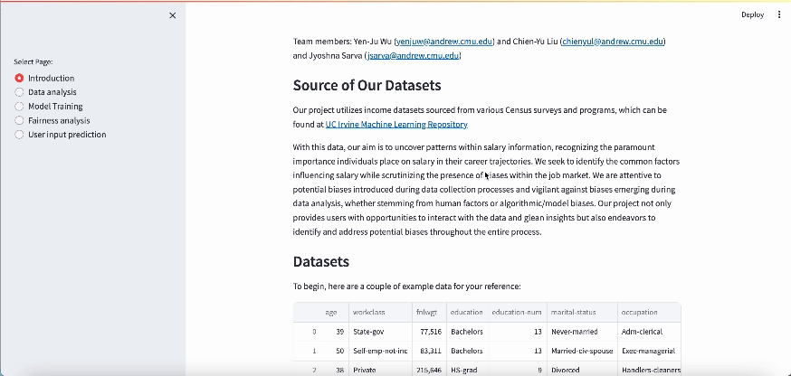

# FairPay: Empowering Fairness in Interactive Income Analysis

## Team Members
- Chien-Yu Liu (chienyul@andrew.cmu.edu)
- Yen-Ju Wu (yenjuw@andrew.cmu.edu)
- Jyoshna Sarva (jsarva@andrew.cmu.edu)

## Project Overview
Our project utilizes income datasets sourced from various Census surveys and programs, which can be found at [UC Irvine Machine Learning Repository](https://archive.ics.uci.edu/dataset/2/adult). 

With this data, our aim is to uncover patterns within salary information, recognizing the paramount importance individuals place on salary in their career trajectories. We seek to identify the common factors influencing salary while scrutinizing the presence of biases within the job market. We are attentive to potential biases introduced during data collection processes and vigilant against biases emerging during data analysis, whether stemming from human factors or algorithmic/model biases. Our project not only provides users with opportunities to interact with the data and glean insights but also endeavors to identify and address potential biases throughout the entire process.

## Development
We developed our project **from scratch**, incorporating the following functionalities:

- Interactive data visualization and analysis capabilities
  - We've included histograms and pie charts, allowing users to specify the feature they're interested in.
- Model training and prediction functionalities
  - We train our models using our training data, employing both Random Forest and Logistic Regression models.
- User input prediction, allowing users to choose the preferred model for prediction
  - Users can input their data and select a model, allowing our system to make predictions based on their input.

All the functionalities mentioned above offer a highly interactive experience.

## Access our website
We've launched our website for users to explore! Feel free to visit the website we've crafted [here]().

## Website overview

## Building and testing locally
If you're intrigued by our project and wish to build upon it, you can clone our repository. The primary website logic resides in src/app.py and can be customized to suit your needs. To launch the website, simply navigate to the src directory and execute the command `streamlit run app.py`.

## Reflections
### Bias analysis
Throughout our project, we've identified some potential biases. 
- Firstly, there's a sampling bias, where over 90% of the data is derived from white individuals and over 66% from males. This imbalance in the data renders it unrepresentative of each demographic group, thereby limiting the generalizability of our results to the broader population. 
- Secondly, there's a concern regarding response bias, as the data is collected through survey responses. This prompts questions about the honesty of respondents and whether there were adequate data validation processes in place to ensure the reliability of the information collected.
- Next, our Fairness analysis page of our website reveals potential biases within different demographic groups. For instance, when analyzing the 'race' feature, our plotted data indicates that both White individuals and Asian-Pacific Islanders have over 25% of individuals earning incomes larger than $50K, whereas other racial groups have less than 12.5%. Similarly, when 'sex' is selected as the feature, the data shows that over 30% of males in the dataset earn salaries larger than $50K, while less than 11% of females achieve the same.

Our main conclusion emphasizes that bias can arise not only from models but also from the process of data collection itself. Therefore, it's vital to establish guidelines for fair data collection to effectively mitigate potential biases.

### Pilot user study
We've conducted several user studies to enhance our project's deliverables.
- Yichen Zhang: "There can be a place on the website for the user to put in features on a new person and have the website generate predicted income (or the likelihood of an outcome) using the model. 
It can also support having different models (Logistic Regression, Random Forest, …) so that the users have a choice."
- Holly Wang: "The team can make the website more interactive, and maybe allowing users to upload their own dataset and use the visualization tools provided, as well as leaving an option for the user to export their visualizations as a PDF or other file type."

In response to the feedback received, we've introduced a User Input Prediction page where users can input their information and choose a model for prediction.

### Lesson learned from lectures
All members of our team are currently enrolled in the computational data science program at CMU, having strong backgrounds in data science. Prior to taking this course, we were well-versed in the data analysis process. However, we had little awareness of how the data collection, analysis, and model prediction phases could potentially introduce biases and unfairness. It's excited that we've acknowledged the significance of fairness and integrated it into our project. This crucial insight was gained through our participation in the Human AI Interaction course!

## Disclaimer
Kindly be aware that our project is designed to offer an interactive experience for analyzing potential biases in salary prediction and analysis. Therefore, it's important to acknowledge that bias might be involved in the process.

